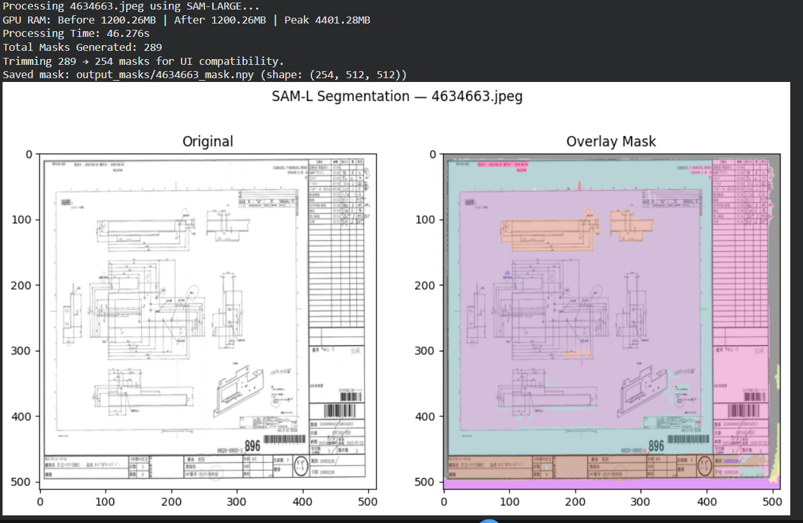
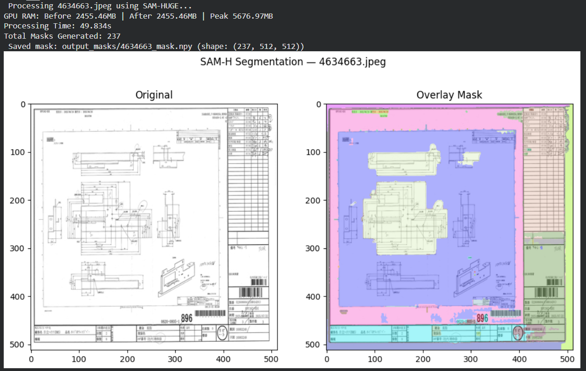

# 🧠 Segment Anything Model (SAM) — ViT-B / ViT-L / ViT-H Segmentation

This repository demonstrates **automatic image segmentation** using **Meta AI's Segment Anything Model (SAM)** — tested across three variants:  
**ViT-B (Base)**, **ViT-L (Large)**, and **ViT-H (Huge)**.

Each version processes uploaded images, generates high-quality binary masks, saves them as `.npy` files, and visualizes overlay masks for easy inspection.

---

## 🚀 Features

- 🔹 Supports **SAM-B**, **SAM-L**, and **SAM-H** model checkpoints  
- 🎨 Saves both `.npy` mask arrays and colored overlay visualizations  
- ⚙️ GPU memory tracking (`Before | After | Peak`)  
- ⏱️ Processing time measurement per image  
- 🧩 Edge-enhancement preprocessing for better segmentation  
- 🧰 Compatible with Google Colab and local environments  

---

# SAM - BASE

# SAM - LARGE

# SAM - HUGE

